# 基于SEIR模型的传染病预测软件开发报告

  姓名：陶乐天  学号：2018010771  班级：汽83  邮箱：tlt18@mails.tsinghua.edu.cn  

## 1 操作页面及用户使用说明

### (1) 界面说明

​           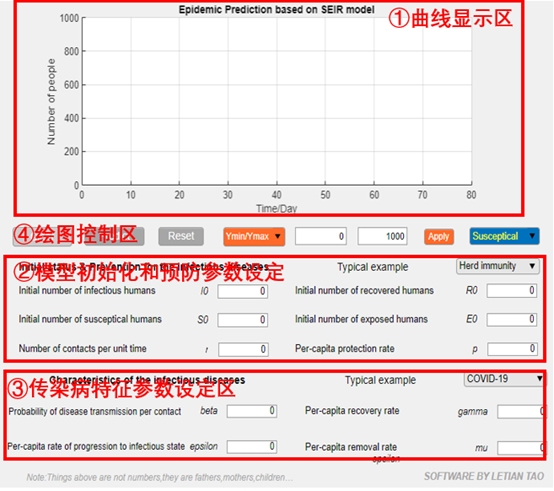                    

App页面主要分为4个区域，分别是：曲线显示区、模型初始化和预防参数设定区、传染病特征参数设定区、绘图控制区。

① 曲线显示区：显示模型预测的不同人数量随时间的变化曲线。

② 模型初始化和预防参数设定区：设定初始化参数（S健康人数、E潜伏区人数、I发病人数、R康复人数）和r单位时间接触次数、p个人防护率。

③  传染病特征参数设定区：设定  每次接触感染概率、  单位时间从潜伏期发展到病发的概率、  单位时间治愈概率、  单位时间致死概率。

④ 绘图控制区：控制绘图、设定基本参数、设定坐标轴区间、设定绘制对象人数。

### (2) 使用说明

#### a. 曲线显示区&绘图控制区

曲线显示区主要功能为显示模型预测的不同人数量随时间的变化曲线。

绘图控制区的主要功能为控制绘图、设定基本参数、设定坐标轴区间、设定绘制对象人数。

 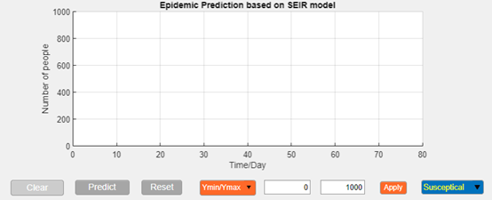

Clear:清除显示区的曲线。

Predict:在曲线显示区显示给定输入参数下模型预测的不同情况人数变化曲线。

Reset:快速设定默认输入参数和坐标。

坐标显示范围：输入预定的曲线观测区间。

Apply:应用XY观测区间。

坐标区:选择不同情况的人作为观测对象（S健康人数、E潜伏区人数、I发病人数、R康复人数）在曲线显示区内进行显示。

#### b. 模型初始化和预防参数设定区

该区域主要功能为

① 设定人员初始化参数：S0健康人数、E0潜伏区人数、I0发病人数、R0康复人数。

②  预防参数设定：r单位时间接触次数、p个人防护率。可以在Typical example中选择特定的预防措施，自动设置预防参数。

 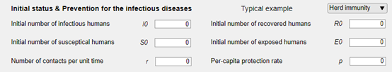

#### c. 传染病特征参数设定区

该区域主要功能为设定β每次接触感染概率、ϵ单位时间从潜伏期发展到病发的概率、γ单位时间治愈概率、μ单位时间致死概率。 

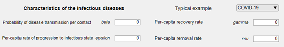

### (3) 注意事项

a. 该app回调函数中采用sim函数调用模型SEIR_model.slx，应把该文件放在可访问的文件夹中。

b. SEIR_model.slx模型预算1000s的仿真时长，若观测区间大于1000days将会显示不全，需要手动调整slx文件时间参数。

 

## 2 回调函数设计说明

(1) Predict预测

点击Predict在曲线显示区生成图像。先将全部输入参数导入base workspace，在local workspace调用SEIR_model.slx模型，最后根据不同的预测对象设定绘制图像。

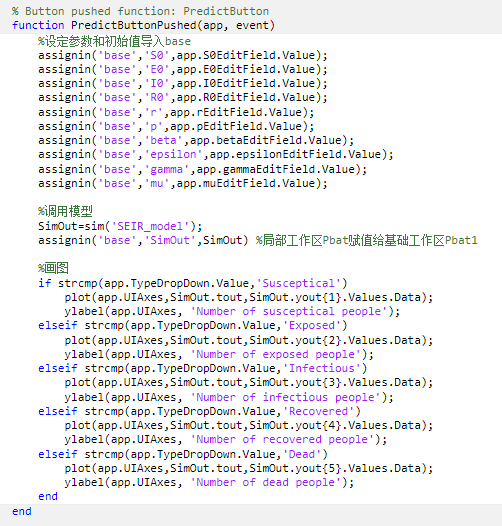

(2) Reset重新设置

重新设定图像显示区窗口位置、区间和默认输入参数。

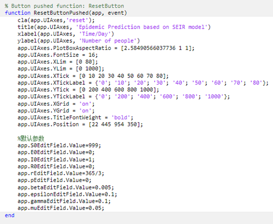

(3) 预防类型下拉菜单

根据用户对不同预防措施的选择设定预测参数r、p。

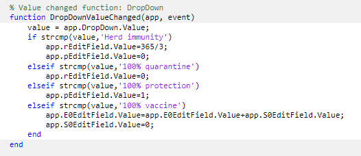

(4) 病毒类型选择

给定经典类型，用户选择后病毒传染参数会自动改变。

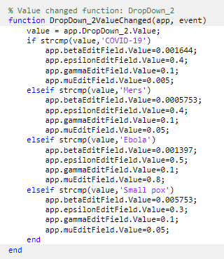

(5) 不同对象预测选择

选择不同情况的人作为观测对象（S健康人数、E潜伏区人数、I发病人数、R康复人数）在曲线显示区内进行显示。

 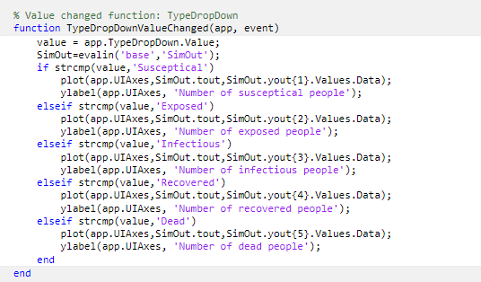

(6) Clear曲线清除

清除曲线显示区中曲线。

 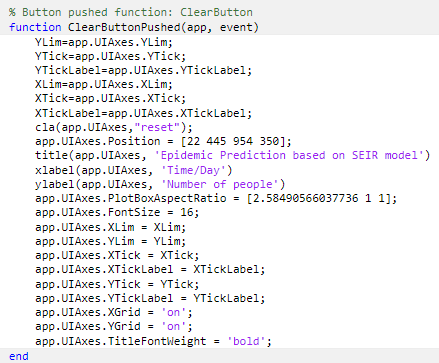

(7) Apply应用观测范围设置

在曲线显示区坐标范围设为用户输入的坐标范围。

 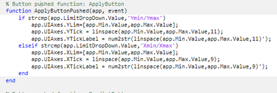

## 3 生成及安装

 (1) 打包生成

 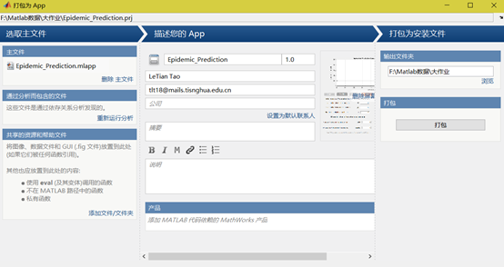

 (2) 安装使用

 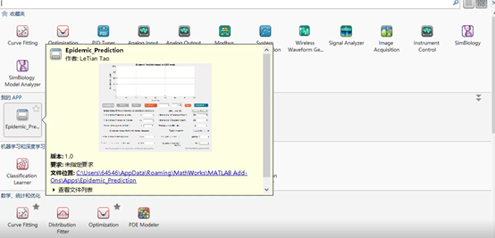

4. 程序使用示例

 见附件“基于SEIR模型的传染病预测软件使用示例.mp4”

